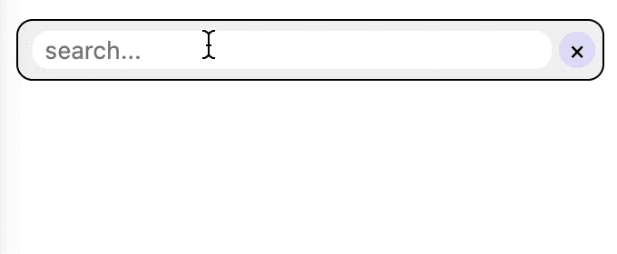

This is a [Next.js](https://nextjs.org/) component: SearchInput.


## Screenshot
example data: 
```[{"pid": "101", "pname": "apple" }, {"pid": "102", "pname": "banana" }, {"pid": "103", "pname": "orange" }]```




## Files
- `components/searchinput.js`
- `styles/searchinput.module.css`

## HOW TO IMPORT THE COMPONENT
```js
// disable ssr for random id
import dynamic from 'next/dynamic'
const SearchInput = dynamic(import('../components/searchinput').then(mod => mod.SearchInput), { ssr: false })
```
